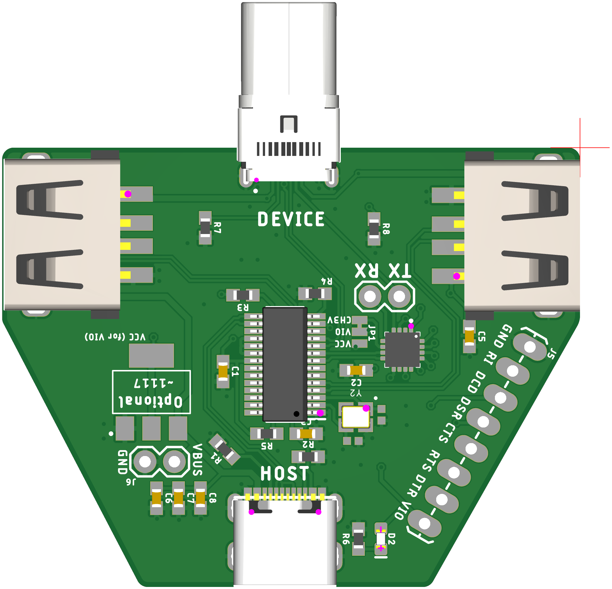

# flow3r-pot

A tool that gives access to a UART port on USB-C SBU pins.
It combines a USB to UART IC and a USB hub to connect both the USB port of the device and the UART itself to the connected USB Host.

The design can be ordered at JLCPCB Assembly service with the included gerber, bom and cpl file.

You can change the IO voltage by placing your own reference voltage LDO on the LDL1117 footprint and cut and re-solder JP1. By default the 3v3 reference is supplied by the CH343P.

The extra IOs from the CH343P are broken out to pin headers. This can be useful if you plan on using this board with other hardware.

While this was developed for the flow3r badge there is nothing inherently specific to that hardware. You can design you own board that places UART on the two SBU pins of your USB-C connector and use this as a debugger for that hardware as well.

Or modify it and put SWD on those pins instead. None of this is USB-C compliant but there is also fairly little to no risk of damaging anything if you were to plug this into a normal device but proceed at your own risk of course. The SBU pins are usually used for either digital audio or analog audio so devices usually will expect voltages up to 3v3 on those pins.

You can also do spicy things like supply an external VBUS via the pin headers.

The 2x USB-A connectors just break out the available extra ports on the USB hub. They are completely optional and are standard USB ports, nothing special about them. Purely for convenience and because we can (and its very cheap).

